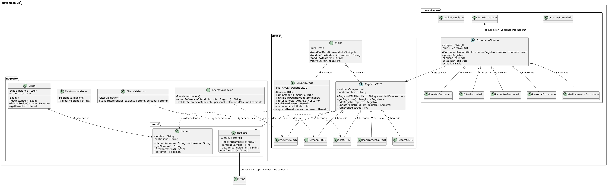

# Sistema de Gestión del Centro de Salud Ganimedes — Entrega de la tarea

Aplicación de escritorio en Java 21 y Swing que administra personal médico,
pacientes, citas, medicamentos, recetas y usuarios, con persistencia local en
archivos de texto y control de acceso por inicio de sesión.

Este documento recoge la evidencia de la tarea en cuatro bloques:
análisis de paradigmas, modelado UML con patrones, implementación
multiparadigma y calidad del código con pruebas automatizadas.

---

## 1. Análisis comparativo de paradigmas y selección justificada

### 1.1 Caso de uso específico del sistema

El Centro de Salud Ganimedes necesita una aplicación de escritorio para:

- Autenticar a los profesionales de salud (inicio de sesión con tres
  intentos y bloqueo).
- Gestionar el alta, consulta, actualización y eliminación (CRUD) de
  personal médico, pacientes, citas, medicamentos y recetas.
- Validar que las citas referencien pacientes y personal existentes y que
  las recetas correspondan a la cita elegida.
- Persistir los registros en archivos locales (`datos/*.txt`) sin base de
  datos externa.
- Exponer una interfaz gráfica de ventanas (Swing) con menú principal,
  formularios por módulo y autocompletado de referencias.

### 1.2 Comparación de paradigmas

| Paradigma | Ventajas | Desventajas | Adequación al caso |
| --- | --- | --- | --- |
| **Orientado a objetos** (Java, C#) | Modelado natural de entidades (paciente, cita, receta); encapsulamiento; herencia para reutilizar formularios y CRUD; integración nativa con Swing; manejo de excepciones tipado | Más verbosidad que el enfoque funcional; riesgo de acoplamiento si no se aplican principios SOLID | **Alta**: la interfaz Swing y las entidades del dominio encajan directamente en clases y objetos |
| **Funcional** (Haskell, Scala, lambdas de Java) | Funciones de orden superior; composición; ausencia de efectos secundarios facilita el razonamiento y las pruebas; excelentes transformaciones de colecciones | La interfaz gráfica imperativa (Swing) se adapta mal; la persistencia en archivos es inherentemente imperativa; curva de aprendizaje | **Media**: útil como complemento para transformar y filtrar datos (lambdas, `Comparator`), no como base única de la aplicación |
| **Imperativo/estructurado** (C, Pascal) | Ejecución directa y eficiente; bajo nivel de abstracción fácil de depurar; control explícito del flujo | Poca reutilización; duplicación en los cinco módulos CRUD; difícil de mantener a medida que crecen los formularios; sin encapsulamiento de estado | **Baja**: los cinco módulos con la misma lógica exigirían duplicar código sin plantillas ni herencia |
| **Lógico/declarativo** (Prolog, SQL) | Expresión de reglas y consultas de forma declarativa; separación entre hechos y razonamiento | Sin soporte natural de interfaz gráfica de escritorio; persistencia y E/S laterales; ecosistema pobre para escritorio Swing | **Muy baja**: no cubre la interfaz ni el flujo interactivo del caso |

### 1.3 Criterios técnicos de selección (restricción de diseño trazable)

La selección se justifica con los siguientes criterios explícitos:

| # | Criterio técnico | Por qué favorece la selección |
| --- | --- | --- |
| C1 | **Interfaz de escritorio Swing obligatoria** | Swing es una librería orientada a objetos: componentes, listeners y jerarquías de clases. Un paradigma OO es el único que la usa de forma natural. |
| C2 | **Reutilización entre cinco módulos CRUD idénticos en estructura** | La herencia (`RegistroCRUD`, `FormularioModulo`) elimina la duplicación; el paradigma imperativo no ofrece ese mecanismo. |
| C3 | **Manejo de errores y excepciones con mensajes en español** | Java ofrece `try/catch/finally`, excepciones tipadas (`IOException`, `IllegalArgumentException`) y validación temprana en constructores. |
| C4 | **Integración de transformaciones de datos (autocompletado, filtrado)** | Java 21 permite lambdas y `Comparator` dentro del paradigma OO: se obtiene lo mejor de OO y funcional sin cambiar de lenguaje. |
| C5 | **Reutilización del proyecto NetBeans/Ant existente (JDK 21)** | El repositorio ya estaba construido sobre Java; migrar a otro lenguaje/paradigma invalidaría el trabajo previo y el historial Git. |

**Restricción de diseño RD-01 (trazable):** *El sistema se implementa en
Java 21 con el paradigma orientado a objetos como base, integrando
expresamente programación funcional (lambdas, referencias a métodos y
funciones de orden superior como `Comparator`) en las capas de negocio y
presentación para el tratamiento de colecciones de datos del sistema
(referencias de pacientes, personal, líneas de archivos).* Esta restricción
se observa en el código en los puntos citados en la sección 3.

---

## 2. Modelado de sistemas de software con UML y patrones de diseño

### 2.1 Diagrama de clases UML



Tipos de relaciones representadas (mínimo requerido: 3):

1. **Herencia** — `RegistroCRUD extends CRUD`; las cinco subclases CRUD;
   `FormularioModulo` y sus cinco formularios concretos.
2. **Agregación** — `FormularioModulo` usa un `RegistroCRUD` durante su
   vida útil sin poseerlo; `Login` mantiene una referencia al `Usuario`
   de la sesión.
3. **Composición** — `Registro` posee y copia defensivamente sus campos
   (`String[]`); `MenuFormulario` posee y administra las ventanas internas
   (`JInternalFrame`) que crea.
4. **Dependencia** — los validadores (`CitasValidacion`,
   `RecetaValidacion`) y `UsuarioCRUD` dependen de clases de otras capas
   para realizar su trabajo puntual.

### 2.2 Patrones de diseño aplicados (mínimo requerido: 2)

#### Patrón 1 — Singleton (instancias únicas de persistencia)

**Dónde:** `UsuarioCRUD`, `CitaCRUD`, `PacienteCRUD`, `PersonalCRUD`,
`MedicamentoCRUD`, `RecetaCRUD` (Singleton *eager*) y `Login` (Singleton
*perezoso*).

**Código:**

```java
// src/sistemasalud/datos/UsuarioCRUD.java
private static final UsuarioCRUD INSTANCE = new UsuarioCRUD();
private UsuarioCRUD() { super("datos/usuarios.txt"); }
public static UsuarioCRUD getInstance() { return INSTANCE; }
```

**Justificación — por qué resuelve el problema del caso:** el sistema
mantiene un único punto de acceso a cada archivo de datos. Varias
ventanas abiertas en simultáneo (menú MDI con varios formularios
internos) comparten la misma instancia de persistencia, evitando
instancias duplicadas que lean o escriban el mismo archivo con estado
inconsistente. El constructor privado impide crear segundas instancias
por error.

#### Patrón 2 — Template Method (esqueleto CRUD y de formularios reutilizable)

**Dónde:** `RegistroCRUD` (abstracta) define el esqueleto
leer/validar/serializar/escribir; las cinco subclases solo declaran
archivo y número de campos. `FormularioModulo` (abstracta) define el
esqueleto del formulario CRUD (alta, baja, actualización, tabla); los
cinco formularios concretos solo declaran título, campos y columnas.

**Código:**

```java
// src/sistemasalud/datos/RegistroCRUD.java — esqueleto fijo
public final ArrayList<Registro> getRegistros() throws IOException { ... }
public final void addRegistro(Registro registro) throws IOException { ... }

// src/sistemasalud/presentacion/CitasFormulario.java — personalización
public class CitasFormulario extends FormularioModulo {
    public CitasFormulario() {
        super("Citas de pacientes", "Cita",
              new String[]{"Paciente", "Personal médico", "Fecha", "Hora", "Motivo"},
              new String[]{"ID", "Paciente", "Personal médico", "Fecha", "Hora", "Motivo"},
              CitaCRUD.getInstance());
    }
}
```

**Justificación — por qué resuelve el problema del caso:** los cinco
módulos del sistema (personal, pacientes, citas, medicamentos, recetas)
comparten el 100 % de la lógica de CRUD y de interfaz; solo cambian los
campos y el archivo de destino. El patrón concentra la lógica en una
clase base y obliga a las subclases a personalizar únicamente lo
diferente, reduciendo el código de cada formulario a ~14 líneas y
cualquier corrección del comportamiento CRUD en un solo lugar.

**Patrones adicionales presentes (soporte):** *Value Object* (`Registro`,
`Usuario` con campos `final` y copias defensivas) y *Factory* implícita en
`FormularioModulo.CampoEntrada`, que crea el control adecuado
(`JTextField`, `JSpinner` de fecha/hora o autocompletado) según la
etiqueta del campo.

---

## 3. Implementación del módulo funcional con integración multiparadigma y tratamiento de datos personales

### 3.1 Integración de dos o más paradigmas con encapsulamiento completo

El código integra **orientado a objetos** (base) y **funcional**
(lambdas y funciones de orden superior):

| Paradigma | Evidencia en el código |
| --- | --- |
| Orientado a objetos | Clases `Registro`, `Usuario`, jerarquía `CRUD → RegistroCRUD → *CRUD`, jerarquía `FormularioModulo → *Formulario`; encapsulamiento con atributos `private final` y constructores validados (`Registro.java`, `Usuario.java`). |
| Funcional | Lambdas y referencias a métodos aplicadas a datos del sistema (ver 3.2). |

Encapsulamiento: los modelos exponen solo *getters* y copias defensivas
(`Registro.getCampos()` devuelve `Arrays.copyOf`); la persistencia
(`CRUD`) oculta la resolución de rutas y la escritura atómica tras
métodos `protected synchronized`.

### 3.2 Funciones de orden superior aplicadas a datos del sistema (mínimo requerido: 2)

**HOF 1 — `Comparator.comparingInt` con lambda** sobre las referencias de
pacientes y personal del sistema, para ordenar las sugerencias del
autocompletado (`src/sistemasalud/presentacion/FormularioModulo.java`,
líneas 601–602):

```java
Collections.sort(coincidencias, Comparator.comparingInt((Referencia referencia)
        -> puntuarCoincidencia(referencia.getValor(), textoNormalizado)).reversed());
```

Recibe una función (`lambda` que puntúa cada referencia) y la aplica a la
colección de coincidencias de pacientes/personal/citas cargada desde
archivo.

**HOF 2 — `removeIf` con referencia a método** para filtrar las líneas leídas
del archivo de datos (`src/sistemasalud/datos/CRUD.java`, línea 91):

```java
lineas.removeIf(String::isBlank);
```

`removeIf` recibe un `Predicate<String>` (función de orden superior) y lo
aplica a cada línea del archivo para descartar vacíos antes de parsear
los registros del sistema.

**Evidencia adicional (soporte):** lambdas `ActionListener` aplicadas a la
interacción con los datos del sistema, por ejemplo
`evento -> abrirFormulario("Pacientes", new PacientesFormulario())`
(`MenuFormulario.java:126`), `event -> iniciarSesion()`
(`LoginFormulario.java:144`) y `evento -> agregarRegistro()`
(`FormularioModulo.java:95`); referencias a métodos
`this::jButton2ActionPerformed` (`UsuariosFormulario.java:114`).

### 3.3 Manejo de errores y excepciones

- **Validación temprana en constructores:** `Registro` y `Usuario` lanzan
  `IllegalArgumentException` con mensajes en español si un campo está
  vacío o contiene `;` o saltos de línea.
- **Errores de persistencia:** `CRUD` valida índice
  (`IndexOutOfBoundsException`), contenido vacío y multi-línea
  (`IllegalArgumentException`) y propaga `IOException` con mensajes que
  identifican archivo y número de registro (`RegistroCRUD.getRegistros`).
- **Captura en la interfaz:** los formularios usan captura multi-etiqueta
  y muestran el diálogo de error al usuario, por ejemplo:

```java
} catch (IOException | IllegalArgumentException | IndexOutOfBoundsException ex) {
    mostrarError(ex);
}
```

- **Acumulación de errores de negocio:** `CitasValidacion` acumula todos
  los problemas de referencia en un `StringBuilder` y lanza una única
  `IllegalArgumentException` con el listado completo.
- **Login:** el fallo de carga de usuarios se informa con
  `JOptionPane` sin propagar la excepción al hilo de eventos de Swing.

### 3.4 Tratamiento de datos personales

El sistema gestiona datos personales de pacientes (nombre, fecha de
nacimiento, teléfono, dirección) y de personal médico (nombre,
especialidad, teléfono, correo), además de credenciales de acceso.

Estado actual de la protección:

- La captura de la contraseña en el formulario de inicio de sesión usa
  `JPasswordField`, que oculta el texto mientras se escribe.
- El control de acceso limita el módulo **Usuarios** a la sesión
  administradora (`usuarios.setEnabled(usuario.esAdmin())` en
  `MenuFormulario`).
- La validación de teléfonos (`TelefonoValidacion`) y de referencias
  (`CitasValidacion`, `RecetaValidacion`) impide la entrada de datos
  malformados en los registros personales.

**Limitación reconocida:** el archivo `datos/usuarios.txt` almacena las
contraseñas en texto plano y la tabla del formulario de usuarios muestra
la columna «Contraseña». Esta limitación se analiza como riesgo concreto
en la sección 4.4, conforme al requisito de reflexión sobre exposición
de datos personales.

### 3.5 Commits del repositorio Git

El repositorio contiene **22 commits** (requeridos: 10 o más) con
mensajes descriptivos en español, por ejemplo:

| Commit | Mensaje |
| --- | --- |
| `1f4ddb3` | Recetas CRUD Implementado |
| `4352217` | Testing añadido |
| `74a027e` | Mejor sistema para registrar citas y mejoras en la interfaz. |
| `6a6d48c` | Usuario ADMIN por defecto |
| `5f0e7ea` | CRUDS Implementados |
| `9f925db` | Usuario Formulario y CRUD Implementado |
| `769ff10` | Formulario Login implementado |
| `93e6c2d` | Primer commit |

---

## 4. Calidad del código, buenas prácticas, pruebas automatizadas y consecuencias sobre los usuarios

### 4.1 Principios SOLID aplicados (mínimo requerido: 2)

**SRP — Responsabilidad única:**
Cada clase del paquete `negocio` tiene un único motivo de cambio:
`TelefonoValidacion` solo valida teléfonos, `CitasValidacion` solo
valida referencias de citas, `UsuarioCRUD` solo persiste usuarios y
`Registro` solo representa un registro inmutable. Ninguna mezcla
persistencia con validación o con interfaz.

**OCP — Abierto/cerrado:**
`FormularioModulo` está abierta a extensión (nuevos módulos) y cerrada a
modificación: agregar un módulo nuevo (por ejemplo, «Vacunas») exige
crear una subclase de ~14 líneas sin tocar la clase base que contiene la
lógica de alta, baja, actualización y tabla. Lo mismo aplica a
`RegistroCRUD` frente a los cinco CRUD concretos.

**DIP — Inversión de dependencias (soporte):**
`FormularioModulo` depende de la abstracción `RegistroCRUD`, no de las
clases concretas `CitaCRUD`, `PacienteCRUD`, etc.; el formulario
concreto inyecta la implementación en el constructor
(`src/sistemasalud/presentacion/FormularioModulo.java`, atributo
`private final RegistroCRUD crud`).

### 4.2 Buenas prácticas con ejemplos del código (mínimo requerido: 4)

1. **Inmutabilidad y copias defensivas** — `Registro` guarda una copia
   del arreglo de campos y `getCampos()` devuelve otra copia
   (`Registro.java:13` y `Registro.java:33`), evitando que un modificador
   externo altere un registro ya persistido.
2. **Validación temprana de entradas** — los modelos rechazan datos
   inválidos en el constructor antes de que lleguen a disco
   (`Usuario.validarCampo`, `Registro`), fallando cerca del origen.
3. **Escritura atómica de archivos** — `CRUD.escribirLineas` escribe en
   un temporal y usa `Files.move(..., ATOMIC_MOVE)` con *fallback*
   (`CRUD.java:100-111`), evitando archivos corruptos si la aplicación
   se interrumpe a mitad de escritura.
4. **Separación en capas** — paquetes `datos` (persistencia), `negocio`
   (modelos y validaciones) y `presentacion` (Swing); ninguna clase de
   negocio conoce `JOptionPane` y ninguna de presentación parsea
   archivos línea a línea.
5. **Mensajes de error accionables en español** — cada excepción indica
   qué registro y qué archivo falló («El registro 3 de usuarios.txt debe
   contener nombre y contraseña»), facilitando la corrección al usuario
   y al desarrollador.
6. **Código muerto y artefactos excluidos** — `.gitignore` excluye
   `build/`, `dist/` y `nbproject/private/`, manteniendo el repositorio
   limpio.

### 4.3 Pruebas automatizadas (mínimo requerido: 3)

El proyecto incluye **4 clases de prueba con 20 casos de prueba** sobre
JUnit 4.13.2, ejecutables con `ant test`.

**Resultados de ejecución** (`ant test`, BUILD SUCCESSFUL):

```text
[junit] Testsuite: sistemasalud.negocio.CitasValidacionTest
[junit] Tests run: 4, Failures: 0, Errors: 0, Skipped: 0, Time elapsed: 0.053 sec
[junit] Testsuite: sistemasalud.negocio.TelefonoValidacionTest
[junit] Tests run: 7, Failures: 0, Errors: 0, Skipped: 0, Time elapsed: 0.041 sec
[junit] Testsuite: sistemasalud.negocio.model.RegistroTest
[junit] Tests run: 4, Failures: 0, Errors: 0, Skipped: 0, Time elapsed: 0.04 sec
[junit] Testsuite: sistemasalud.negocio.model.UsuarioTest
[junit] Tests run: 5, Failures: 0, Errors: 0, Skipped: 0, Time elapsed: 0.039 sec

BUILD SUCCESSFUL
```

**Total: 20 pruebas, 0 fallos, 0 errores.**

| Clase de prueba | Pruebas | Qué cubre |
| --- | --- | --- |
| `TelefonoValidacionTest` | 7 | Límites de longitud, separadores internacionales, rechazo de letras, `+` mal ubicado, paréntesis sin cerrar |
| `UsuarioTest` | 5 | Getters, `esAdmin()`, rechazo de nombre vacío, contraseña con salto de línea y nombre con `;` |
| `RegistroTest` | 4 | Guardado de campos, `trim()`, rechazo de campo vacío y de `;` |
| `CitasValidacionTest` | 4 | Referencias válidas, normalización de acentos/mayúsculas, fallo cuando el paciente o el personal no existen (con *fixture* que respalda y restaura los archivos de datos) |

### 4.4 Reflexión sobre las consecuencias de baja calidad o exposición de datos personales

Los datos que maneja el sistema —nombres, fechas de nacimiento,
teléfonos, direcciones, diagnósticos implícitos en las recetas y
credenciales— son datos personales y, en el caso de las recetas y
citas, información sensible de salud. La normativa vigente en Chile (Ley
19.628 sobre protección de la vida privada y su reglamento, más los
lineamientos de privacidad por defecto) exige que el responsable del
tratamiento adopte medidas de seguridad desproporcionadas con el riesgo
y evite la exposición indebida.

**Consecuencias concretas de baja calidad del código:**

- Un error de escritura no atómica podría corromper `recetas.txt` o
  `citas.txt`, provocando que un profesional de salud vea diagnósticos
  o citas de otro paciente, o que se pierdan registros clínicos
  históricos del centro.
- La ausencia de validación de entradas permitiría campos con `;` o
  saltos de línea que desplazarían registros: un paciente podría ver los
  datos de otro en la tabla, violando la confidencialidad de la historia
  clínica.
- Un manejo deficiente de excepciones en el login podría informar al
  atacante si un usuario existe, facilitando ataques de enumeración
  contra cuentas de profesionales de salud.

**Consecuencias concretas de la exposición de datos personales
(limitación actual):**

- Las contraseñas en texto plano en `datos/usuarios.txt` significan que
  cualquier persona con acceso al equipo (o una copia del archivo, o el
  historial de Git si el archivo se versiona) puede leer todas las
  credenciales y suplantar a un médico o administrador, accediendo a
  nombres, teléfonos, direcciones y diagnósticos de todos los pacientes
  del centro.
- Mostrar la columna «Contraseña» en la tabla del formulario de usuarios
  permite que un usuario mirando la pantalla de un profesional capture
  credenciales (efecto *shoulder surfing*), riesgo elevado en entornos
  clínicos con circulación de personal.
- Si un archivo de datos se pierde o se copia sin protección, la
  exposición en texto plano elimina cualquier posibilidad de mitigar el
  daño revocando contraseñas: el daño a la privacidad de los pacientes
  es irreversible.
- Para los profesionales de salud, la suplantación de identidad puede
  generar registros médicos falsos a su nombre; para los pacientes, el
  acceso no autorizado a sus datos personales y de salud vulnera su
  derecho a la privacidad y puede causar discriminación o extorsión si
  la información se difunde.

Estas consecuencias justifican que, en una evolución del sistema, las
contraseñas se almacenen con función de derivación criptográfica (por
ejemplo PBKDF2/BCrypt con sal) y que la interfaz nunca muestre
credenciales, tal como exige el requisito de tratamiento de datos
personales sin exposición en texto plano.

---

## Compilar, probar y ejecutar

Requisitos: JDK 21, Apache Ant (incluido con NetBeans).

```text
ant compile
ant test
ant jar
ant run
```

Si Ant no encuentra la plataforma del proyecto, indícala a la línea de
comandos:

```text
ant -Dplatforms.Microsoft_21.0.12.1.home=<ruta_al_JDK> test
```

Credencial predeterminada (si `datos/usuarios.txt` está vacío):
`ADMIN` / `ADMIN`.

La clase principal es `sistemasalud.SistemaSalud`. El JAR generado es
`dist/SistemaSalud.jar`.

## Estructura del proyecto

```text
CentroDeSalud/
├── src/sistemasalud/
│   ├── SistemaSalud.java       # Punto de entrada
│   ├── datos/                  # Persistencia (CRUD, RegistroCRUD, *CRUD)
│   ├── negocio/                # Modelos, login y validaciones
│   └── presentacion/           # Formularios Swing
├── test/sistemasalud/          # Pruebas JUnit 4 (20 casos)
├── capturas/                   # Capturas de pantalla
├── nbproject/                  # Configuración NetBeans/Ant
├── build.xml                   # Tareas de Ant
└── README.md                   # Este documento
```

## Capturas

### Inicio de sesión


### Menú principal


