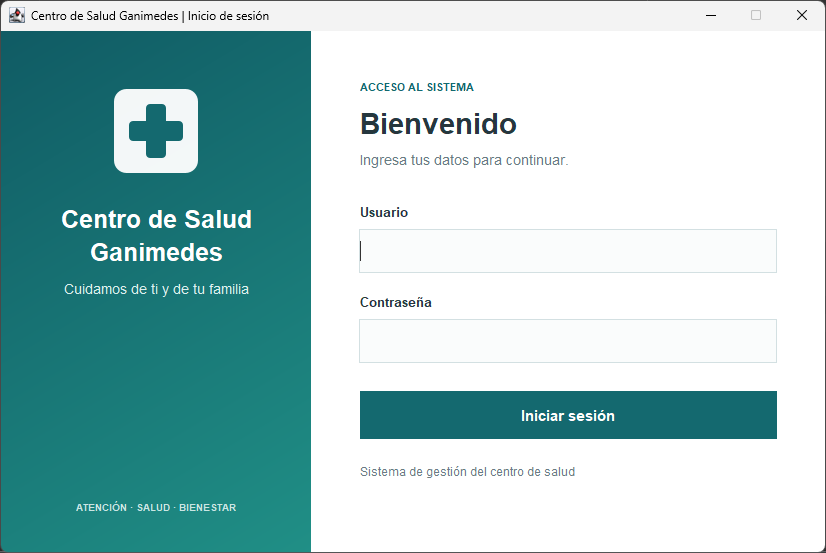
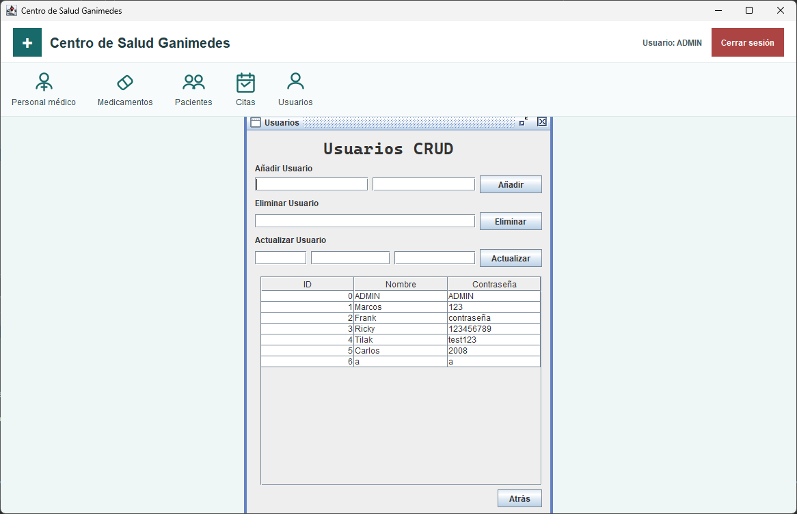

# Sistema de Gestión del Centro de Salud Ganimedes

Aplicación de escritorio desarrollada con Java y Swing para administrar
información básica de un centro de salud. Incluye inicio de sesión y módulos
para gestionar personal médico, pacientes, citas, medicamentos y usuarios.

> **Aviso:** es una aplicación de ejemplo con persistencia local en archivos
de texto. Los nombres de usuario y las contraseñas se almacenan sin cifrar;
no uses datos personales o clínicos reales en un entorno no protegido.

## Funcionalidades

- Inicio y cierre de sesión. Tras tres intentos fallidos, el formulario de
  inicio de sesión queda deshabilitado hasta reiniciar la aplicación.
- Operaciones de alta, consulta, actualización y eliminación de personal,
  pacientes, citas y medicamentos.
- Administración de usuarios, disponible al iniciar sesión con la cuenta
  administradora predeterminada.
- En las citas, selección de pacientes y personal desde listas que se
  actualizan con los registros existentes.

Los campos de los módulos son:

| Módulo | Campos |
| --- | --- |
| Personal médico | Nombre, especialidad, teléfono y correo |
| Pacientes | Nombre, fecha de nacimiento, teléfono y dirección |
| Citas | Paciente, personal médico, fecha, hora y motivo |
| Medicamentos | Nombre, presentación, existencia e indicaciones |
| Usuarios | Nombre y contraseña |

## Tecnologías y requisitos

- JDK 21 o posterior. El proyecto configura `javac.source` y `javac.target`
  como `21` en `nbproject/project.properties`.
- Apache Ant, incluido normalmente con NetBeans.
- NetBeans IDE es opcional; el proyecto utiliza su estructura Java/Ant.
- No requiere una base de datos ni dependencias externas configuradas.

## Compilar, probar y ejecutar

Ejecuta estos comandos desde la carpeta raíz del proyecto, donde se encuentra
`build.xml`:

```text
ant compile
ant test
ant jar
ant run
```

- `ant compile` compila las clases en `build/`.
- `ant test` ejecuta las pruebas definidas en `test/`. Actualmente no hay
  pruebas automatizadas en esa carpeta.
- `ant jar` genera `dist/SistemaSalud.jar`.
- `ant run` inicia la aplicación desde Ant.

También puedes abrir la carpeta del proyecto en NetBeans y usar las acciones
**Build**, **Test** y **Run**. La clase principal es
`sistemasalud.SistemaSalud`.

Para ejecutar el JAR compilado:

```text
java -jar dist/SistemaSalud.jar
```

## Inicio de sesión

Si `datos/usuarios.txt` no existe o está vacío, al iniciar la aplicación se
crea la cuenta predeterminada:

```text
Usuario: ADMIN
Contraseña: ADMIN
```

Los usuarios existentes no se reemplazan. El módulo **Usuarios** solo está
habilitado para una sesión cuyos datos sean exactamente `ADMIN` y `ADMIN`.
Las contraseñas se guardan y se muestran en texto legible en los archivos y en
la tabla de usuarios; protege el acceso al equipo y a esos archivos.

## Persistencia y formato de los datos

La aplicación guarda los registros en archivos UTF-8 dentro de `datos/`, con
un registro por línea y campos separados por punto y coma (`;`). Los archivos
se crean cuando se necesitan:

| Archivo | Contenido por registro |
| --- | --- |
| `usuarios.txt` | Nombre de usuario; contraseña |
| `personal.txt` | Nombre; especialidad; teléfono; correo |
| `pacientes.txt` | Nombre; fecha de nacimiento; teléfono; dirección |
| `citas.txt` | Paciente; personal médico; fecha; hora; motivo |
| `medicamentos.txt` | Nombre; presentación; existencia; indicaciones |

Los campos son obligatorios y no pueden contener punto y coma ni saltos de
línea. Las fechas se guardan como `AAAA-MM-DD` y las horas como `HH:mm`.
Paciente y personal médico se eligen de listas en el formulario de citas; la
cita guarda sus nombres como referencias.

El ID que muestran las tablas empieza en `0` y corresponde a la posición del
registro en el archivo. Al eliminar un registro, las posiciones posteriores
pueden cambiar. Las operaciones de escritura reemplazan el archivo de forma
atómica cuando el sistema de archivos lo permite.

La ubicación de `datos/` depende de cómo se inicie la aplicación:

- Desde NetBeans o Ant, se usa la carpeta de trabajo actual, normalmente la
  raíz del proyecto.
- Desde el JAR, se usa una carpeta `datos/` junto al JAR; por ejemplo,
  `dist/datos/` para `dist/SistemaSalud.jar`.

Haz copias de seguridad de los archivos de datos antes de moverlos o editar
su contenido.

## Estructura del proyecto

```text
SistemaSalud/
├── src/sistemasalud/          # Punto de entrada de la aplicación
│   ├── datos/                  # Persistencia y operaciones CRUD
│   ├── negocio/                # Lógica de sesión y modelos
│   └── presentacion/           # Formularios Swing
├── test/                       # Pruebas automatizadas (vacío actualmente)
├── datos/                      # Archivos locales de datos
├── capturas/                   # Capturas de pantalla
├── nbproject/                  # Configuración del proyecto NetBeans
├── build.xml                   # Tareas de compilación de Ant
└── manifest.mf                 # Manifest de la aplicación
```

## Capturas

### Inicio de sesión



### Menú principal


